# go-redis


### โปรเจกต์ทดลองวัดผลของการทำ **caching ด้วย Redis** ต่อ performance ของ REST API — เขียนด้วย Go + Fiber + GORM + PostgreSQL และทำ load testing ด้วย k6 + InfluxDB + Grafana

## Cache คืออะไร ?

Cache คือสถานที่เก็บข้อมูลชั่วคราวเพื่อให้สามารถ access ได้ไวขึ้น
- ปกติมักจะใช้กับข้อมูล **“ที่มีการเรียกใช้บ่อย”** เช่น
  - content หน้าแรก
  - ข้อมูลสินค้าที่มีการเรียกใช้บ่อย ๆ

## Redis คือ DB ที่ใช้สำหรับเก็บ cache

- ปกติการอ่าน cache จากแรมจะเร็วกว่าจาก disk อยู่แล้ว (พวกอ่านจาก disk ก็เช่น DB ทั่วๆไปนั่นแหละ) ดังนั้นเราก็จะ setup Redis เป็นแบบ in memory เป็น default ไป

## การทำ cache

เราจะทดลองยิง load test ด้วย k6 ที่ `GET /products` โดยเป็นการดึงข้อมูลสินค้า 30 รายการ เปรียบเทียบ 4 แบบ ทั้งไม่ใช้ cache เลย และใส่ cache ที่ layer ต่าง ๆ

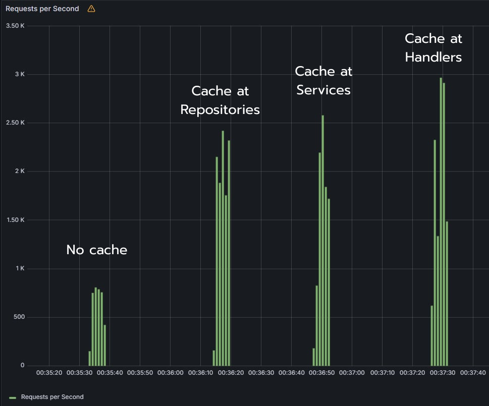

| แบบทดสอบ | Cache ที่ layer | Requests/sec (peak) |
|---|---|---|
| No Redis | — (query DB ทุก request) | ~800 |
| Repo Redis | Repository — cache ผล query จาก DB | ~2,400 |
| Service Redis | Service — cache ผลหลังผ่าน business logic | ~2,600 |
| Handler Redis | Handler — cache JSON response ทั้งก้อน | ~3,000 |

## โครงสร้างโปรเจกต์

```
├── main.go              # ประกอบ dependency + Fiber server
├── Makefile             # คำสั่งลัด (up / run / test / ...)
├── handlers/            # HTTP handler layer (ปกติ / redis)
├── services/            # Business logic layer (ปกติ / redis)
├── repositories/        # Data access layer (ปกติ / redis)
├── docker-compose.yml   # PostgreSQL, Redis, k6, InfluxDB, Grafana
├── config/
│   └── redis.conf       # Redis config (AOF enabled)
├── scripts/
│   └── test.js          # k6 load test script
├── img/                 # ภาพผลการทดลอง
└── data/                # Volume data ของ PostgreSQL / Redis / InfluxDB / Grafana
```

## วิธีใช้งาน

มี [Makefile](Makefile) รวมคำสั่งไว้ให้แล้ว:

| คำสั่ง | ทำอะไร |
|---|---|
| `make up` | สร้างและ start PostgreSQL, Redis, InfluxDB, Grafana (background) |
| `make stop` | หยุด services ชั่วคราว (ไม่ลบ containers) |
| `make start` | start services ที่หยุดไว้กลับมาใหม่ |
| `make run` | รัน `go mod tidy` แล้ว start Go server ที่พอร์ต 8000 |
| `make test` | รัน load test ด้วย k6 |
| `make check` | curl ยิง `GET /products` เช็คว่า server ตอบ |
| `make logs` | ตาม logs ของทุก service |
| `make down` | stop และลบ containers |
| `make clean` | ลบ containers พร้อมล้างโฟลเดอร์ `data/` (ข้อมูลหายหมด) |

#### ลำดับใช้งานปกติ: `make up` → `make run` (ค้างไว้อีก terminal) → `make test`

## วิธีสร้าง Dashboard Grafana 
หลังจากใช้คำสั่ง `make up` ให้เปิด `http://localhost:3000` จะเจอหน้า Grafana (เข้าได้เลยไม่ต้อง login เพราะเปิด anonymous Admin ไว้)

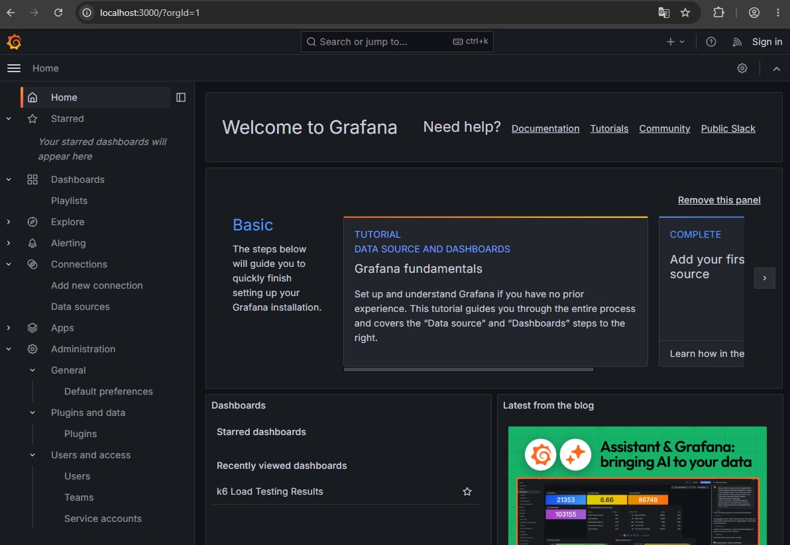

### 1. เพิ่ม InfluxDB data source

ไปที่ **Connections → Data sources → Add data source** เลือก **InfluxDB** แล้วใส่ค่า:

- **URL:** `http://influxdb:8086`
- **Database:** `k6`

กด **Save & test** ให้ขึ้นเครื่องหมายถูกสีเขียว

<details>
<summary>ดูภาพขั้นตอนการตั้งค่า Data Sources</summary>

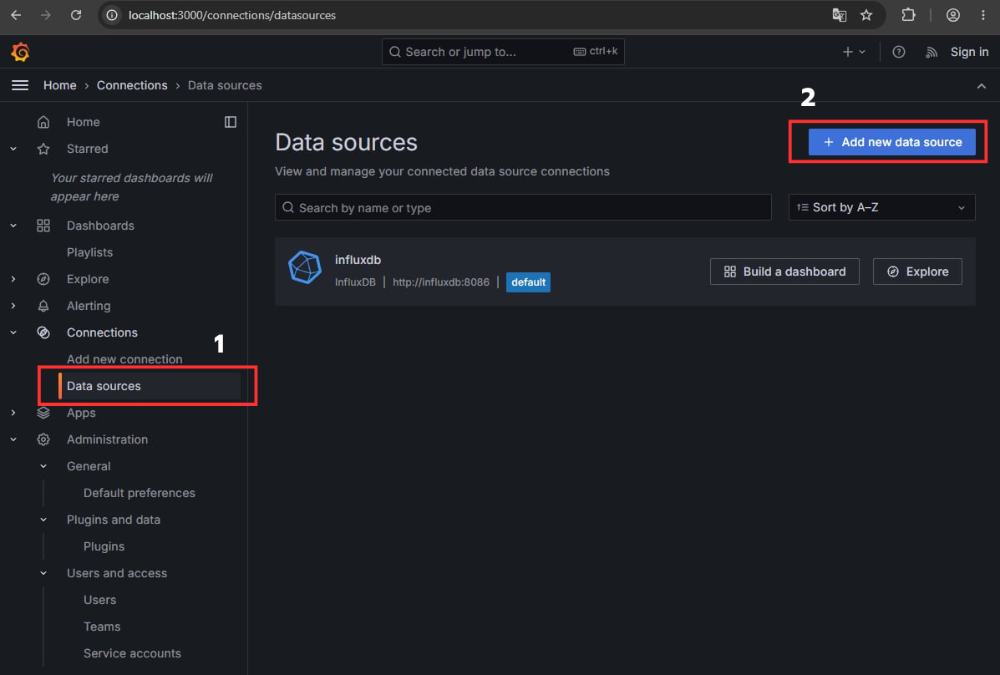

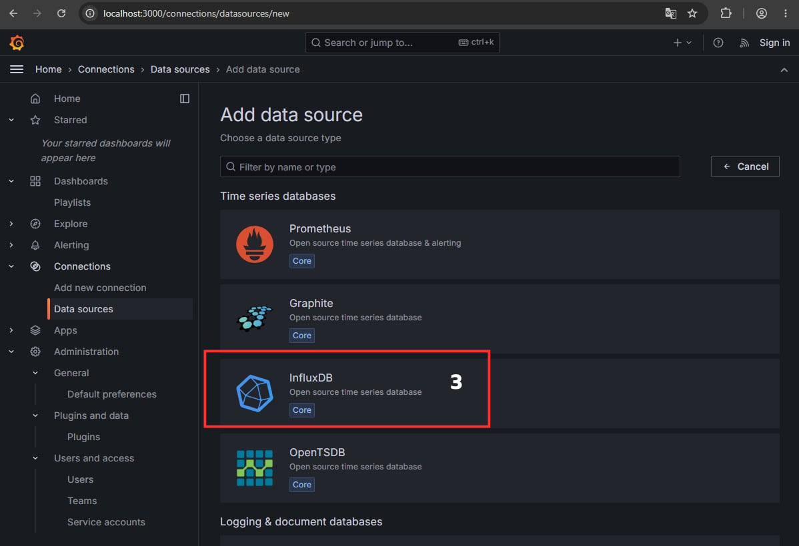

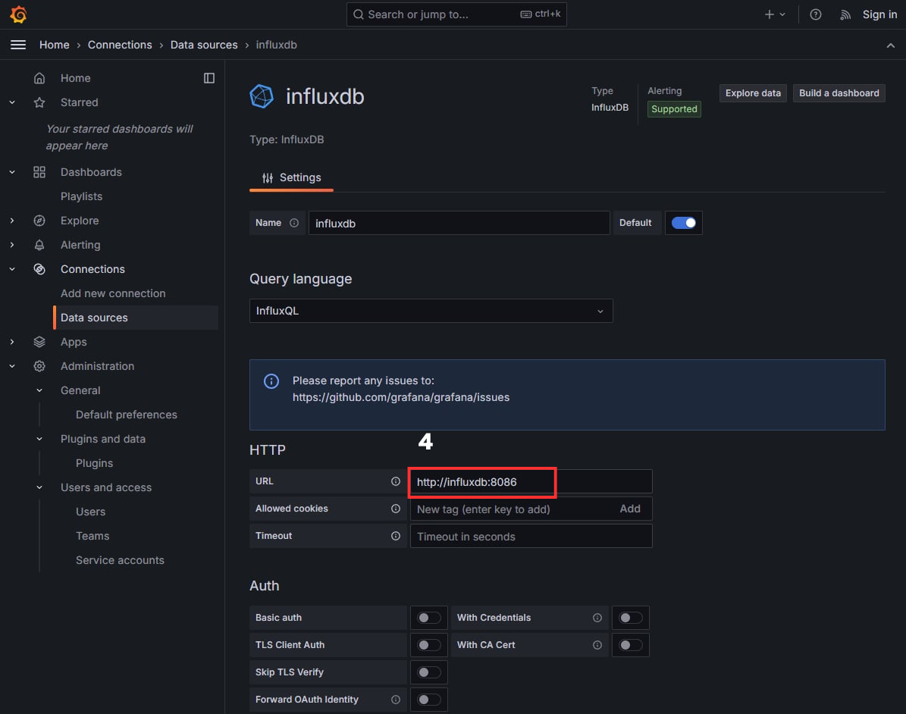

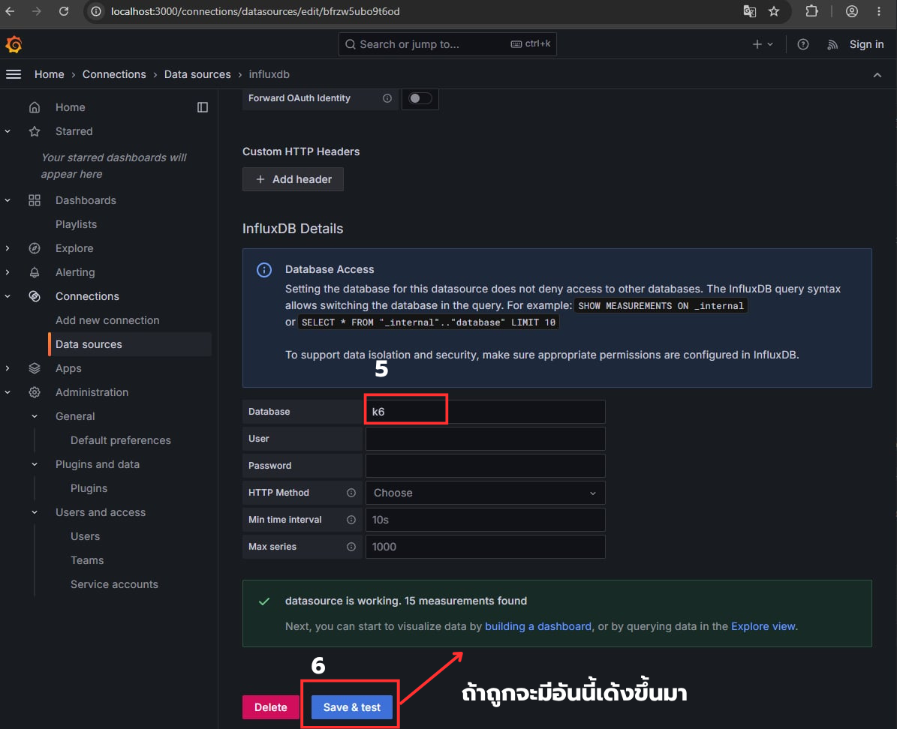

</details>

### 2. Import dashboard สำหรับ k6

ไปที่ **Dashboards → New → Import** ใส่ dashboard ID **2587** (k6 Load Testing Results) กด **Load** แล้วเลือก data source เป็น InfluxDB ที่เพิ่งสร้าง จากนั้นกด **Import** จะเห็นหน้าต่างแบบนี้

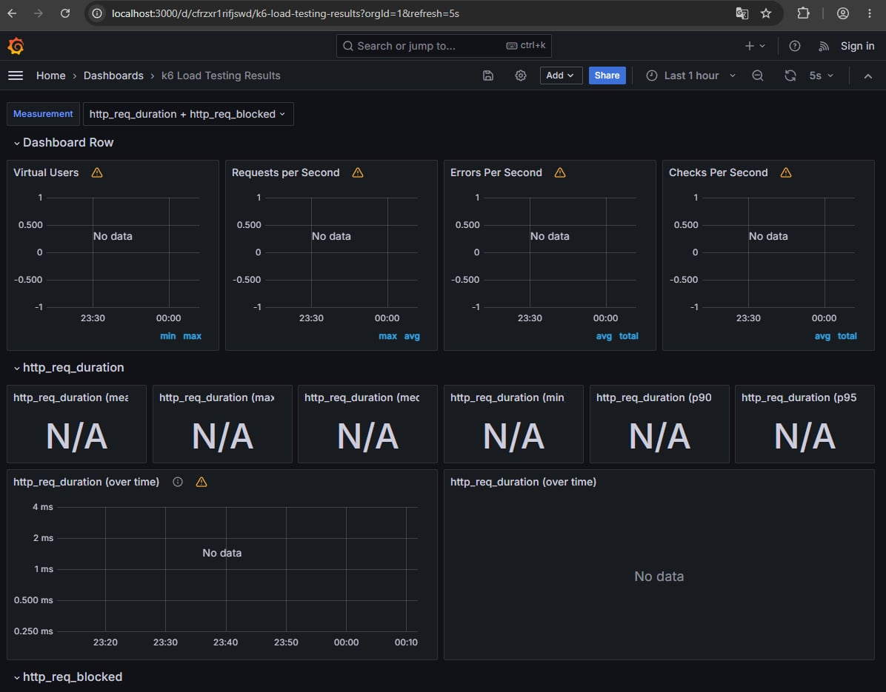

<details>
<summary>ดูภาพขั้นตอนการ Import Dashboard</summary>

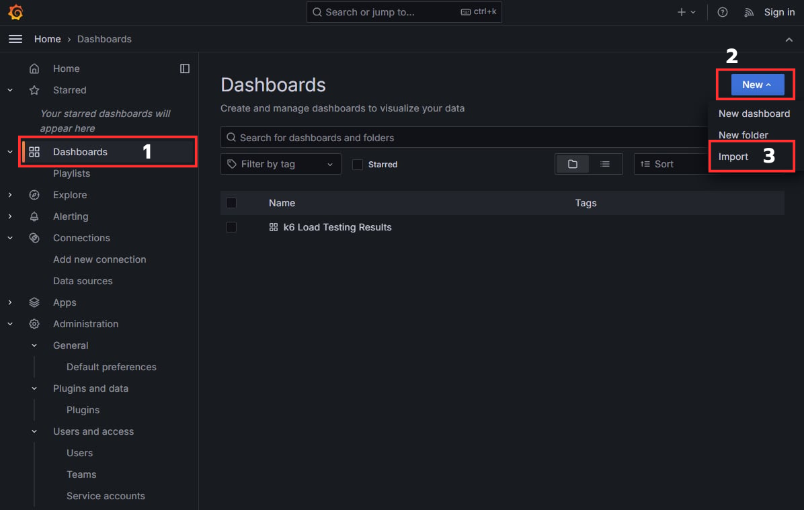

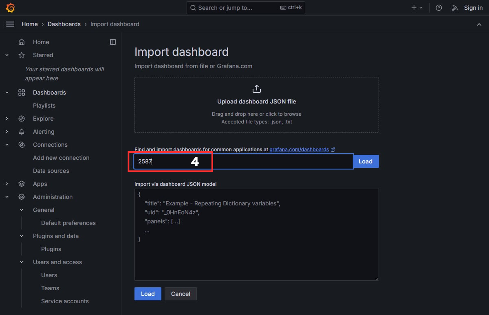

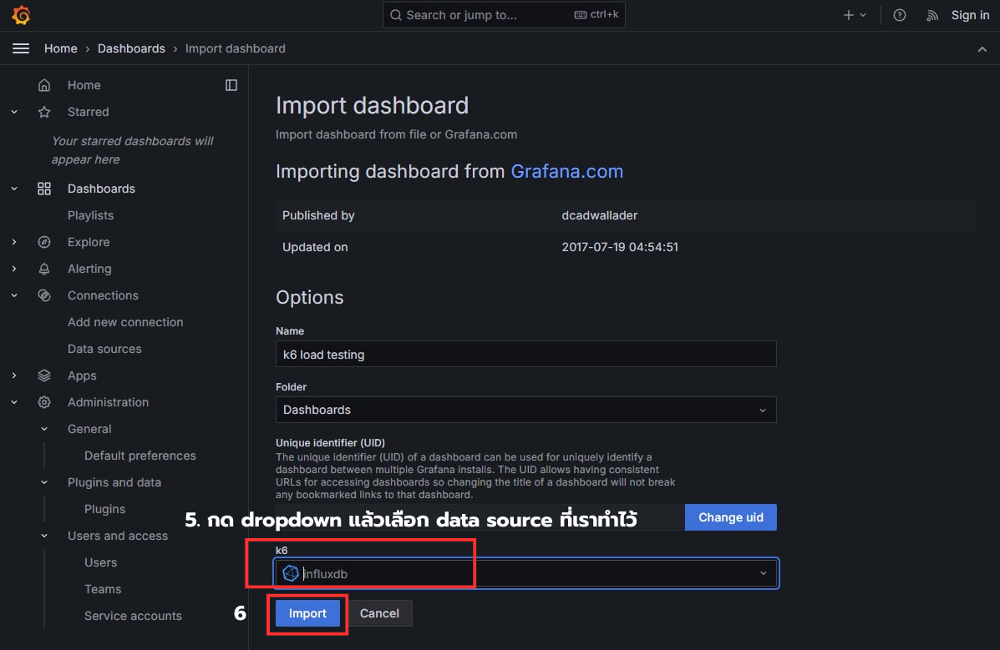

</details>

### 3. รัน server แล้วยิง load test

```bash
make run    # รัน Go server (ค้างไว้อีก terminal)
make test   # ยิง load test ด้วย k6
```

k6 จะส่ง metrics เข้า InfluxDB แล้วกลับมาดูผลได้ใน dashboard ที่ import ไว้ — จะเห็นกราฟ Requests per Second, response time ฯลฯ

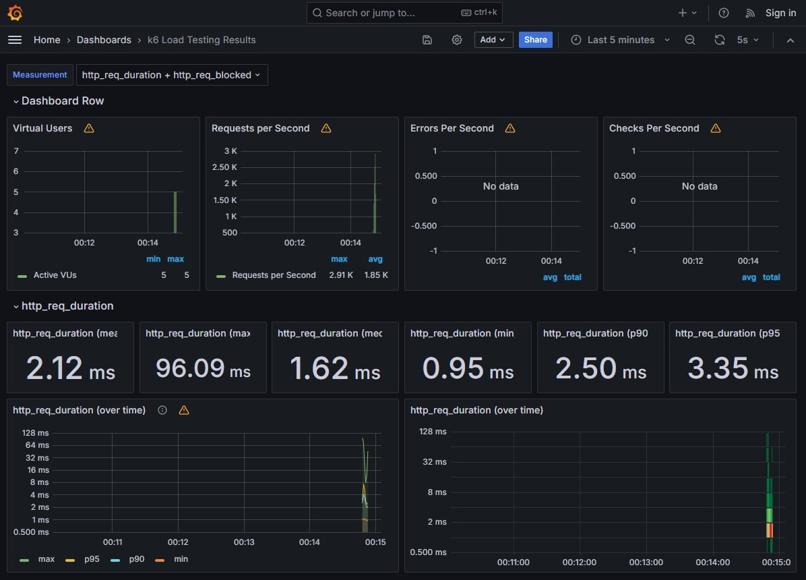

### 4. ลองสลับ layer ที่ cache เปรียบเทียบกัน

โค้ดจัดโครงสร้างตามแนว hexagonal architecture — แต่ละ layer (repository / service / handler) มี interface กลาง จึงสลับ implementation ระหว่างเวอร์ชันปกติกับเวอร์ชัน Redis ได้ที่จุดประกอบ dependency ใน [main.go](main.go) โดย comment/uncomment บรรทัดที่ต้องการ:

```go
productRepo := repositories.NewProductRepositoryDB(db)                          // ไม่มี redis
// productRepo := repositories.NewProductRepositoryRedis(db, redisClient)       // มี redis

productservice := services.NewCatalogService(productRepo)                       // ไม่มี redis
// productservice := services.NewCatalogServiceRedis(productRepo, redisClient)  // มี redis

// productHandler := handlers.NewCatalogHandler(productservice)                 // ไม่มี redis
productHandler := handlers.NewCatalogHandlerRedis(productservice, redisClient)  // มี redis
```

เปลี่ยนแล้วรัน `make run` ใหม่ ตามด้วย `make test` อีกรอบ แล้วเทียบผลแต่ละแบบใน Grafana ได้เลย

